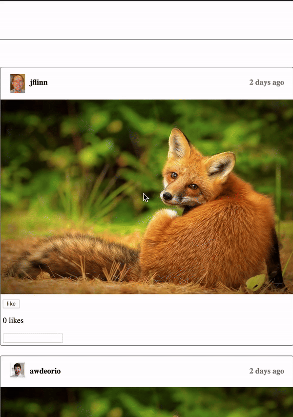

## Projects
### Hazel - Tutorial Systems 
#### [GitHub Repo](https://github.com/hazelgrove/hazel/pull/1330) | [PR](https://github.com/hazelgrove/hazel/pull/1330) | 07/2024 – present  
My current project involves creating and adding a new tutorial mode functionality to Hazel for new users to adapt to the interface. I am working with editor states and ensuring that new users can interact with and receive feedback for their code to familiarize themselves with the syntax and functionality of the programming environment. (PI: Cyrus Omar, Assistant Professor).

  <iframe src="https://hazel.org/build/dev/" width="100%" height="250" frameborder="0" scrolling="yes"></iframe>  

### Insta485 Client-Side Web Application 
#### [Insta485 WebApp](http://ec2-18-219-187-14.us-east-2.compute.amazonaws.com/) | 10/2024  
Developed an Instagram clone as part of a three-project sequence for EECS 485, focusing on building client-side dynamic pages using JavaScript, React, and AJAX. Refactored the server-side logic from Flask into a REST API to handle asynchronous data requests, enabling real-time updates for user interactions such as likes, comments, and infinite scrolling without page reloads. The project also includes features like double-click to like and seamless data fetching. The following credentials can be used to test the system, username: awdeorio, password: chickens. To login as any of the other users within the app, the password for login is "password".

  
  

### Data Retrieval and Parsing Using Web Scraping and APIs
#### [Online BookStore](https://books.toscrape.com/) | [Financial Modelling Prep](https://site.financialmodelingprep.com/playground?url=daily-chart-charts)
Developed and implemented solutions for extracting and parsing data from various sources using both web scraping and APIs. Utilized depth-first search (DFS) to handle hierarchical data structures like comment threads from Hacker News, transforming JSON data into structured DataFrames for analysis. Worked with both HTML parsing and API calls to collect, clean, and organize data by scraping a fake online bookstore and by using the Financial Modelling Prep API, ensuring accuracy and handling edge cases such as dead comments. 

 
  
   

### EDA and Visualizations Toolkit 
#### [Electoral College dataset](https://readysignal.com/electoral-college-data-table/) | [LendingClub dataset](https://github.com/sethns/Data-Preprocessing-in-Python/tree/main) | 09/2024  
As part of our coursework (EECS 398), we used the Electoral College dataset to analyze the impact of the Electoral College on election outcomes, including the difference between popular votes and Electoral College votes, and how it determines the U.S. presidential election results. Cleaned and processed university data from the LendingClub dataset by handling missing values for key metrics including alumni employment and overall score. Developed interactive visualizations using Plotly to compare public and private universities, analyzing relationships between alumni employment rankings and overall institutional scores.

  <iframe src="votes_chloropleth1.html" width="100%" height="400px" frameborder="0" scrolling="yes" style="margin-bottom: 5px;"></iframe>

  <iframe src="loans_box.html" width="100%" height="400px" frameborder="0" scrolling="yes" style="margin-bottom: 5px;"></iframe>

  <iframe src="loans_comp.html" width="100%" height="400px" frameborder="0" scrolling="yes" style="margin-bottom: 5px;"></iframe>

### DIY Hazelnut 
#### [GitHub Repo](https://github.com/reevafaisal/diyHazelnut) | 06/2024  
An implementation of Hazelnut: A Bidirectionally Typed Structure Editor Calculus. Implemented core features of Hazelnut in Reason (OCaml), focusing on bidirectional type synthesis and cursor erasure for functional expressions. Developed key modules for handling higher-order types, expressions, and their cursors, ensuring accurate type compatibility. The building of a hazelnut expression and its type synthesis can be viewed by using the webapp.

### Image Processing App 
#### [Website](https://reevafaisal.pythonanywhere.com/) | [ReadMe](https://github.com/reevafaisal/Image_Processing_ObjectOrientedProgramming) | 06/2023  
Collaborated in a team of two to design and implement an image processing application. Leveraged object-oriented programming and inheritance to simulate a monetized structure, enabling premium features for advanced image processing tasks for the original class project. Integrated a KNN classifier for image label prediction. Voluntarily developed both a GUI and a CLI to enhance user interaction, streamline processing workflows, and track image processing costs, optimizing user experience across multiple interfaces. 
<iframe src="https://reevafaisal.pythonanywhere.com" width="100%" height="250" frameborder="0" scrolling="yes"></iframe>  

